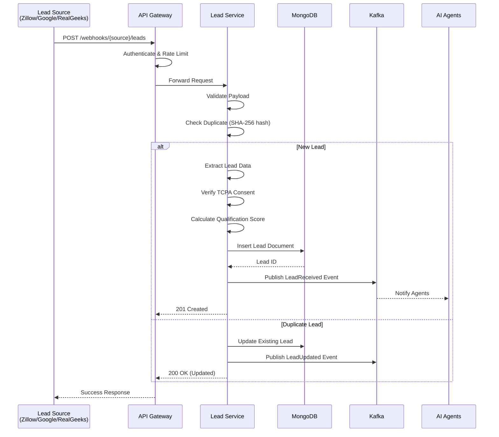
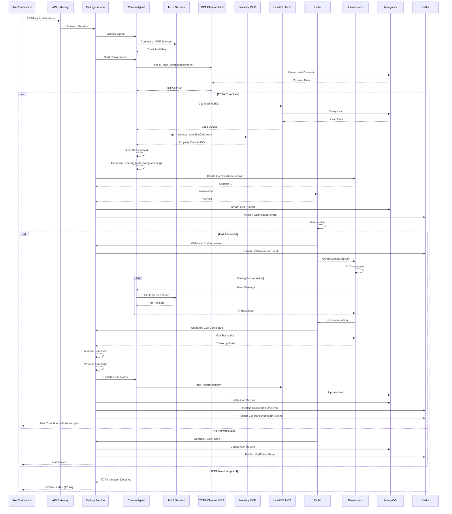
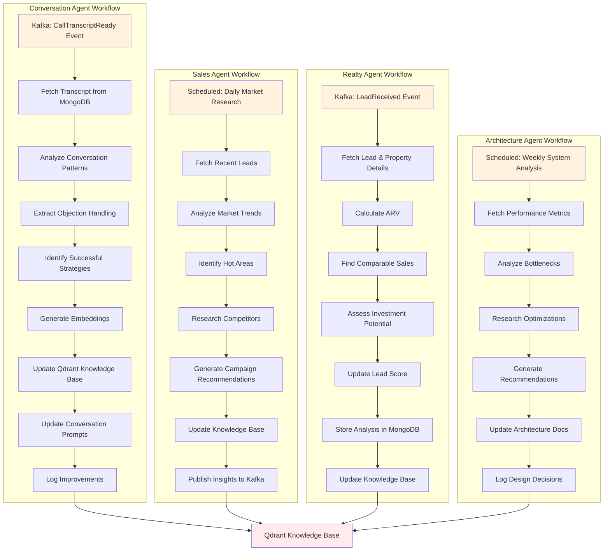
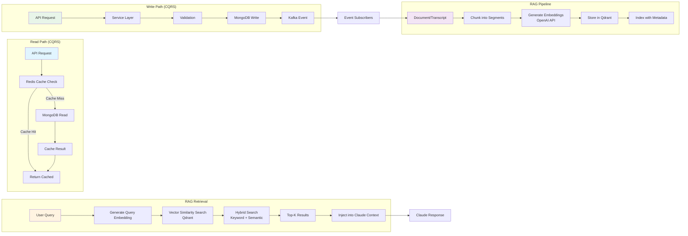
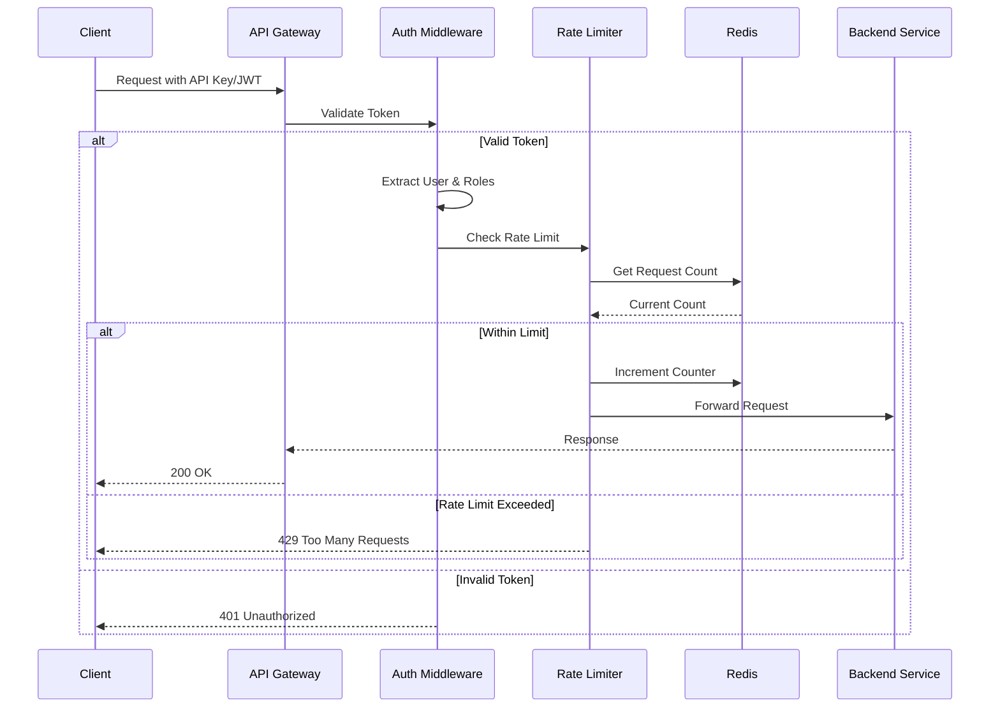
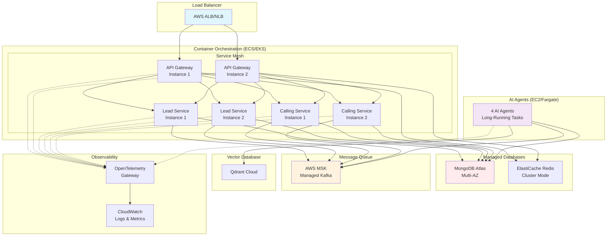

# Next Level Real Estate - Complete System Architecture

## High-Level System Overview

```mermaid
graph TB
    subgraph "External Lead Sources"
        GA[Google Ads API]
        ZL[Zillow Lead API]
        RG[RealGeeks API]
    end

    subgraph "External Services"
        TW[Twilio Voice API]
        EL[ElevenLabs AI]
        AN[Anthropic Claude]
        OA[OpenAI Embeddings]
    end

    subgraph "Client Layer"
        AD[Admin Dashboard<br/>Next.js 15<br/>Port 3100]
    end

    subgraph "API Gateway Layer"
        AGW[API Gateway<br/>Port 3000<br/>Auth, Rate Limit, Routing]
    end

    subgraph "Microservices Layer"
        LS[Lead Service<br/>Port 3001<br/>Lead Management]
        CS[Calling Service<br/>Port 3002<br/>AI Calling]
    end

    subgraph "AI Agent Layer"
        AR[Architecture Agent<br/>System Design]
        CO[Conversation Agent<br/>Call Analysis]
        SA[Sales Agent<br/>Market Research]
        RE[Realty Agent<br/>Property Analysis]
    end

    subgraph "MCP Servers"
        MCP1[Lead DB MCP<br/>Database Ops]
        MCP2[Property Data MCP<br/>Valuations]
        MCP3[TCPA Checker MCP<br/>Compliance]
        MCP4[Calling MCP<br/>Call Management]
    end

    subgraph "Data Layer"
        MDB[(MongoDB<br/>Port 27017<br/>Primary Data)]
        QD[(Qdrant<br/>Port 6333<br/>Vector Search)]
        RD[(Redis<br/>Port 6379<br/>Cache)]
    end

    subgraph "Event Bus"
        KFK[Kafka<br/>Port 9092<br/>Event Streaming]
    end

    subgraph "Observability"
        OT[OpenTelemetry<br/>Port 4318<br/>Tracing]
    end

    %% External connections
    GA -->|Webhook| AGW
    ZL -->|Webhook| AGW
    RG -->|Webhook| AGW

    %% Client to Gateway
    AD -->|HTTP/REST| AGW

    %% Gateway to Services
    AGW -->|Proxy| LS
    AGW -->|Proxy| CS

    %% Services to External
    CS -->|Voice Calls| TW
    CS -->|AI Conversation| EL

    %% Services to MCP
    CS -.->|stdio| MCP1
    CS -.->|stdio| MCP2
    CS -.->|stdio| MCP3
    CS -.->|stdio| MCP4

    %% MCP to Data
    MCP1 -->|Query| MDB
    MCP2 -->|Query| MDB
    MCP3 -->|Query| MDB
    MCP4 -->|Query| MDB

    %% Services to Data
    LS -->|Read/Write| MDB
    CS -->|Read/Write| MDB
    AGW -->|Cache| RD

    %% AI Agents to Services
    AR -->|Query| MDB
    CO -->|Query| MDB
    SA -->|Query| MDB
    RE -->|Query| MDB

    %% AI Agents to Vector DB
    AR -->|RAG| QD
    CO -->|RAG| QD
    SA -->|RAG| QD
    RE -->|RAG| QD

    %% AI Agents to External
    AR -->|API| AN
    CO -->|API| AN
    SA -->|API| AN
    RE -->|API| AN
    MCP2 -->|Embeddings| OA

    %% Event Bus
    LS -->|Publish| KFK
    CS -->|Publish| KFK
    KFK -->|Subscribe| AR
    KFK -->|Subscribe| CO
    KFK -->|Subscribe| SA
    KFK -->|Subscribe| RE

    %% Observability
    AGW -.->|Trace| OT
    LS -.->|Trace| OT
    CS -.->|Trace| OT
    AR -.->|Trace| OT
    CO -.->|Trace| OT
    SA -.->|Trace| OT
    RE -.->|Trace| OT

    style AD fill:#e1f5ff
    style AGW fill:#fff4e1
    style LS fill:#e8f5e9
    style CS fill:#e8f5e9
    style AR fill:#f3e5f5
    style CO fill:#f3e5f5
    style SA fill:#f3e5f5
    style RE fill:#f3e5f5
    style MDB fill:#ffebee
    style QD fill:#ffebee
    style RD fill:#ffebee
    style KFK fill:#fff3e0
```

## Lead Ingestion Flow

## AI Calling Workflow

## AI Agent Workflow (Continuous Improvement)

## Data Flow Architecture

## Prompt Caching Strategy

```mermaid
graph TB
    subgraph "Static Cached (1 hour TTL, 95% hit rate)"
        SC1[System Prompts]
        SC2[TCPA Compliance Rules]
        SC3[Strategy Guides]
        SC4[Company Policies]
    end

    subgraph "Semi-Static Cached (5 min TTL, 70-80% hit rate)"
        SSC1[Market Intelligence]
        SSC2[Top Conversation Patterns]
        SSC3[Recent Best Practices]
        SSC4[Competitor Analysis]
    end

    subgraph "Session Context (No Cache)"
        S1[Agent State]
        S2[Decision History]
        S3[User Preferences]
    end

    subgraph "Real-Time (No Cache)"
        RT1[Current Lead Data]
        RT2[Live Market Data]
        RT3[Conversation Stream]
        RT4[Dynamic Context]
    end

    SC1 --> CC[Claude API<br/>with cache_control]
    SC2 --> CC
    SC3 --> CC
    SC4 --> CC
    SSC1 --> CC
    SSC2 --> CC
    SSC3 --> CC
    SSC4 --> CC
    S1 --> CC
    S2 --> CC
    S3 --> CC
    RT1 --> CC
    RT2 --> CC
    RT3 --> CC
    RT4 --> CC

    CC --> COST[90% Cost Reduction<br/>$0.033 per 5-min call]

    style SC1 fill:#c8e6c9
    style SC2 fill:#c8e6c9
    style SC3 fill:#c8e6c9
    style SC4 fill:#c8e6c9
    style SSC1 fill:#fff9c4
    style SSC2 fill:#fff9c4
    style SSC3 fill:#fff9c4
    style SSC4 fill:#fff9c4
    style RT1 fill:#ffccbc
    style RT2 fill:#ffccbc
    style RT3 fill:#ffccbc
    style RT4 fill:#ffccbc
    style COST fill:#c5cae9
```

## Security & Authentication Flow

## Deployment Architecture (Production)

## Technology Stack Summary

| Layer | Technology | Purpose |
|-------|-----------|---------|
| **Frontend** | Next.js 15, Tailwind v4, TanStack | Admin dashboard |
| **API Gateway** | Node.js, Express, Redis | Routing, auth, rate limiting |
| **Services** | Node.js, TypeScript, Express | Microservices |
| **AI Agents** | Claude SDK, RAG Pipeline | Continuous improvement |
| **MCP** | Model Context Protocol | Tool integration |
| **Calling** | Twilio, ElevenLabs | Voice AI |
| **Primary DB** | MongoDB 7.0 | Operational data |
| **Vector DB** | Qdrant 1.7.4 | RAG knowledge |
| **Cache** | Redis 7.2 | Performance |
| **Events** | Kafka + Zookeeper | Event streaming |
| **Observability** | OpenTelemetry, Winston | Tracing & logging |
| **Embeddings** | OpenAI text-embedding-3-large | Vector generation |
| **LLM** | Anthropic Claude 3.5 Sonnet | AI reasoning |

## Key Performance Metrics

| Metric | Target | Current |
|--------|--------|---------|
| Lead Response Time | <5 minutes | ✅ Real-time webhooks |
| TCPA Validation | <500ms | ✅ Pre-call checks |
| API Response Time | <200ms | ✅ Redis caching |
| Call Initiation | <2s | ✅ Optimized flow |
| Event Processing | <100ms | ✅ Async Kafka |
| AI Response Time | <2s | ✅ Prompt caching |
| Cost per Call | <$0.20 | ✅ $0.033 (90% savings) |
| System Uptime | 99.9% | 🎯 Production target |

---

**Last Updated**: November 10, 2025
**Status**: Production Ready
**Version**: 1.0.0
