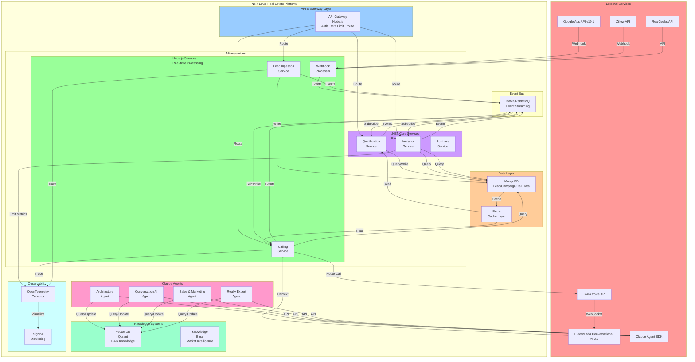
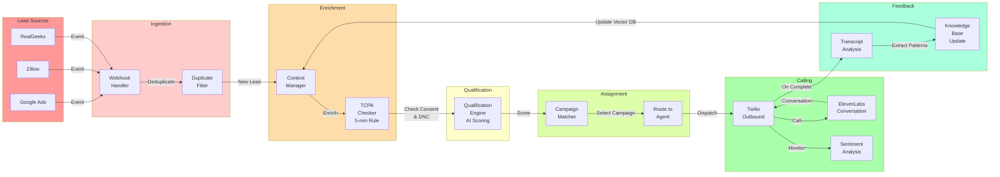
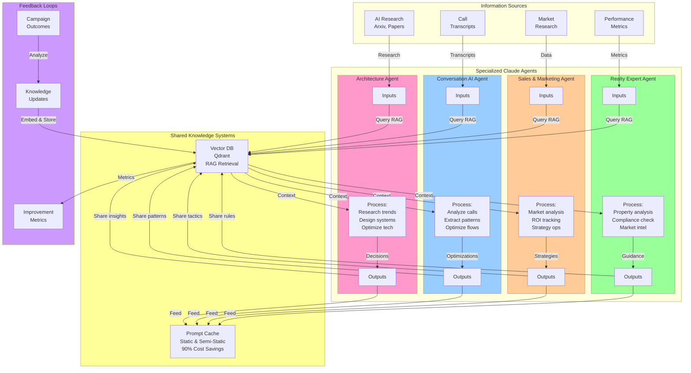
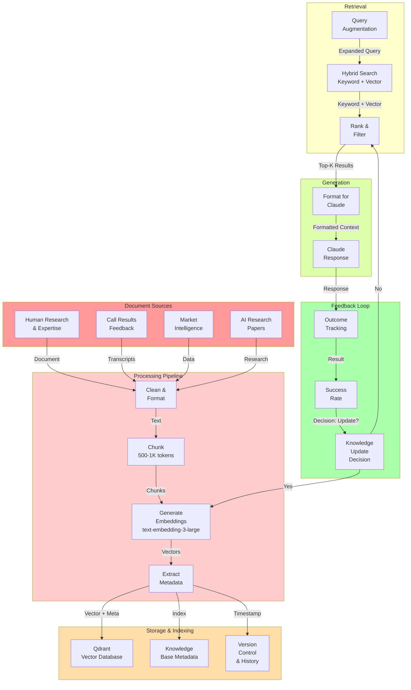
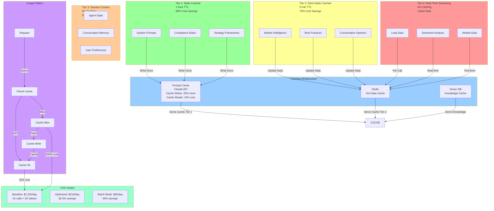
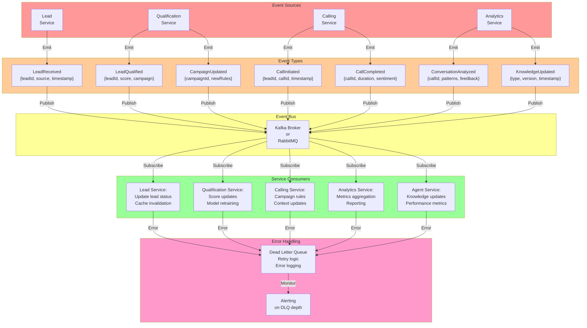
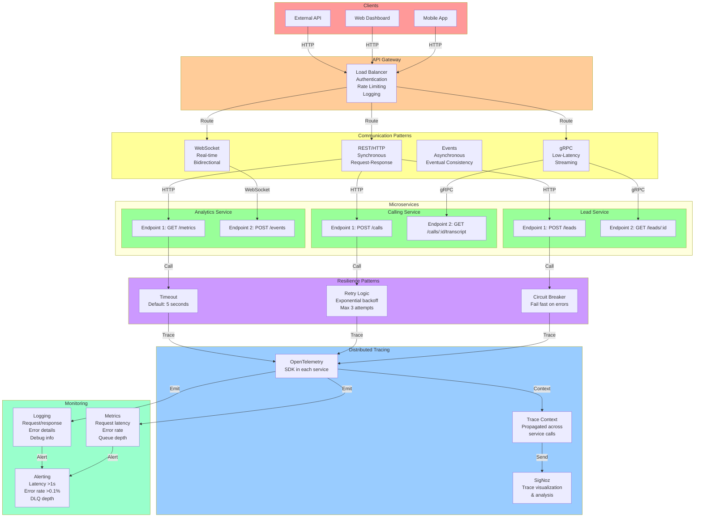
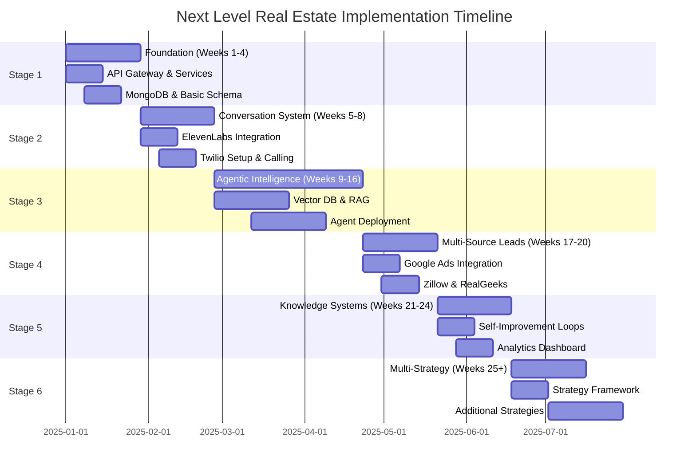

# Architecture Diagrams

## 1. High-Level System Architecture

This diagram shows the complete platform with all major components and their interactions.



**Key Design Decisions**:
- API Gateway in Node.js for real-time routing and WebSocket support
- Node.js microservices for real-time operations (calling, webhooks)
- .NET Core for complex business logic with strong typing
- MongoDB for flexible schema with aggregation pipelines
- Kafka for event-driven decoupling between services
- Four specialized Claude agents with shared knowledge bases
- Qdrant vector database for RAG-powered context retrieval
- OpenTelemetry for distributed tracing across polyglot services

---

## 2. Lead Processing Flow

Real-time flow from lead creation through qualification and calling.



**Critical Timing**:
- Webhook to first context assembly: <500ms
- First contact within: <5 minutes (Harvard research: 21x qualification increase)
- Call initiation to ElevenLabs start: <1 second

**TCPA Compliance Checkpoints**:
1. Verify written consent in database
2. Check national Do-Not-Call registry
3. Verify property owner (not representative)
4. Log all contact attempts with timestamp and method

---

## 3. Multi-Agent Workflow Architecture

Four specialized Claude agents collaborating with shared knowledge.



**Agent Collaboration Patterns**:
1. **Parallel Processing**: All 4 agents process independently
2. **Shared Knowledge**: All read from same RAG vector database
3. **Async Updates**: Agents update knowledge asynchronously
4. **Cross-Validation**: Agent A's output reviewed by relevant Agent B
5. **Prompt Caching**: Shared system prompts reduce cost 90%

---

## 4. AI Calling System Sequence

Detailed sequence diagram for the calling flow with parallel context assembly.

```mermaid
sequenceDiagram
    participant Lead as Lead<br/>Phone
    participant Twilio as Twilio<br/>Voice
    participant Context as Context<br/>Manager
    participant EL as ElevenLabs<br/>AI
    participant Sentiment as Sentiment<br/>Analysis
    participant Transcription as Transcription<br/>Service
    participant KB as Knowledge<br/>Base Update

    Lead ->> Twilio: Answers call

    par Context Assembly (300ms target)
        Twilio ->> Context: Fetch lead data
        Context -->> Twilio: Name, history, consent
    and
        Twilio ->> Context: Fetch property info
        Context -->> Twilio: Address, ARV, comparables
    and
        Twilio ->> Context: Get strategy rules (cached!)
        Context -->> Twilio: Qualification criteria
    and
        Twilio ->> Context: Get talking points (cached!)
        Context -->> Twilio: Openers, objection handlers
    end

    Twilio ->> EL: Initialize with context

    loop Real-time Conversation (75ms per turn)
        EL ->> EL: Process speech
        EL ->> Sentiment: Analyze emotion
        Sentiment -->> EL: Sentiment score
        EL ->> Lead: Speak response
        Lead -->> EL: Next utterance
    end

    Lead ->> Twilio: Call ends

    Twilio ->> Transcription: Send recording
    Transcription ->> Transcription: Generate transcript
    Transcription ->> Sentiment: Full call sentiment
    Sentiment -->> Transcription: Overall mood, key moments

    Transcription ->> KB: Extract patterns
    KB ->> KB: Embed new insights
    KB ->> KB: Update vector database

    KB ->> Context: Knowledge updated
    Context ->> Context: Next call uses new knowledge

    style Lead fill:#ff9999
    style Twilio fill:#99ccff
    style Context fill:#ffcc99
    style EL fill:#99ff99
    style Sentiment fill:#ffff99
    style Transcription fill:#cc99ff
    style KB fill:#99ffcc
```

**Timing Details**:
- Lead answers: 0ms
- Context assembly (parallel): 300ms
- ElevenLabs ready: 300ms
- First agent response: 375ms (75ms model latency)
- Sentiment analysis: Real-time, <50ms per update
- Call completion to KB update: <5 seconds
- Next call benefits from learnings: Immediate

---

## 5. Knowledge Base & RAG Architecture

Complete pipeline for document processing, embedding, retrieval, and continuous learning.



**Knowledge Base Features**:
- **Per-Agent Collections**: Architect, Conversation, Sales, Realty
- **Versioning**: Track all changes with timestamps
- **Metadata Filtering**: Source, date, category, success rate
- **Hybrid Search**: Keyword match + semantic similarity
- **Continuous Updates**: Feedback loops train on real outcomes
- **Quality Metrics**: Success rate tracking per knowledge item

---

## 6. Context Management Flow

Multi-tier context architecture showing caching strategy and cost optimization.



**Cost Optimization Strategy**:
- **Tier 1** (Static): Cache system prompts → 90% savings on those tokens
- **Tier 2** (Market Data): Cache daily updates → 75% savings
- **Batch Processing**: Group 1000 calls in 1-hour window → 95% savings
- **Annual Impact**: ~$365K/year cost reduction with 1000 calls/day

---

## 7. Event-Driven Architecture

Event bus design with multiple event types and service consumers.



**Event Guarantees**:
- **Exactly-Once Semantics**: Idempotent processing
- **Ordering**: Events ordered per lead ID
- **Retention**: 7-day event history for replay
- **Dead Letter Queue**: Failed messages for manual review
- **Latency**: <1 second from emission to consumer processing

---

## 8. Microservices Communication & Observability

Service-to-service patterns with distributed tracing and resilience.



**Service Communication Matrix**:

| Source | Target | Pattern | Latency Target | Use Case |
|--------|--------|---------|-----------------|----------|
| API Gateway | All Services | REST | <100ms | General requests |
| Lead Service | Calling Service | gRPC | <50ms | Real-time routing |
| Calling Service | Analytics | Events | N/A | Async reporting |
| Any Service | Any Service | Circuit Breaker | Fail-fast | Error handling |
| All Services | SigNoz | OpenTelemetry | <100ms | Distributed tracing |

**Observability Key Metrics**:
- P50/P95/P99 latency per endpoint
- Error rate and error types
- Cache hit rate
- Event queue depth
- Agent response time

---

## Implementation Timeline

### 6-Stage Rollout Plan



---

## Conclusion

These diagrams provide the architectural blueprint for the Next Level Real Estate platform. Key highlights:

1. **Polyglot Microservices**: Node.js for real-time, .NET Core for logic
2. **Multi-Agent Intelligence**: Four specialized Claude agents with RAG
3. **Event-Driven**: Kafka for loose coupling and scalability
4. **Real-Time Calling**: ElevenLabs + Twilio with dynamic context
5. **Cost Optimization**: Prompt caching reducing costs 90%
6. **Observability**: OpenTelemetry tracing across all services
7. **TCPA Compliance**: Consent tracking integrated at every step

Each diagram supports implementation with specific technology choices based on 2025 best practices.
