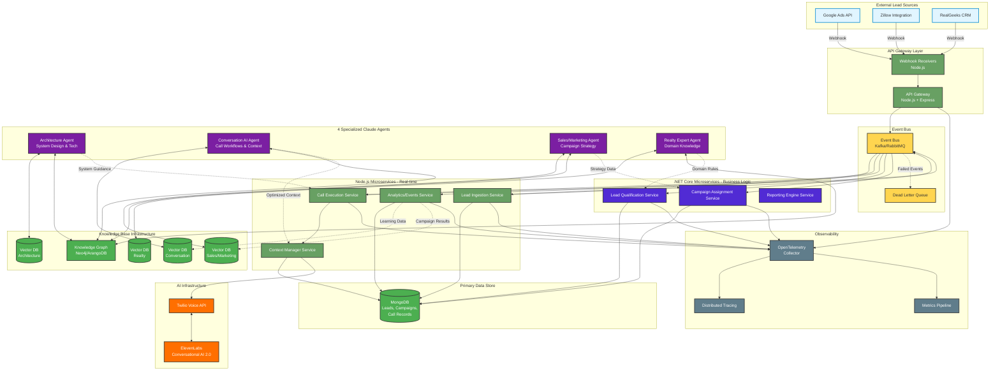
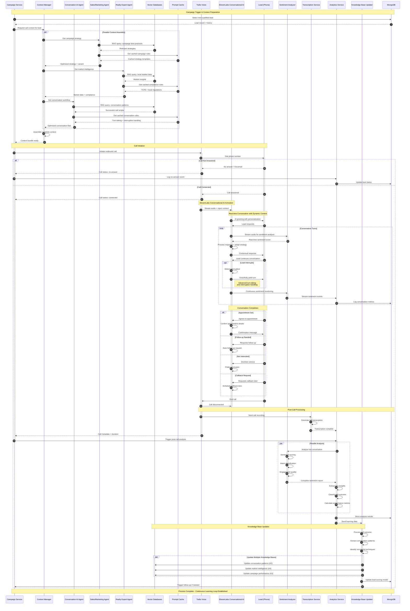
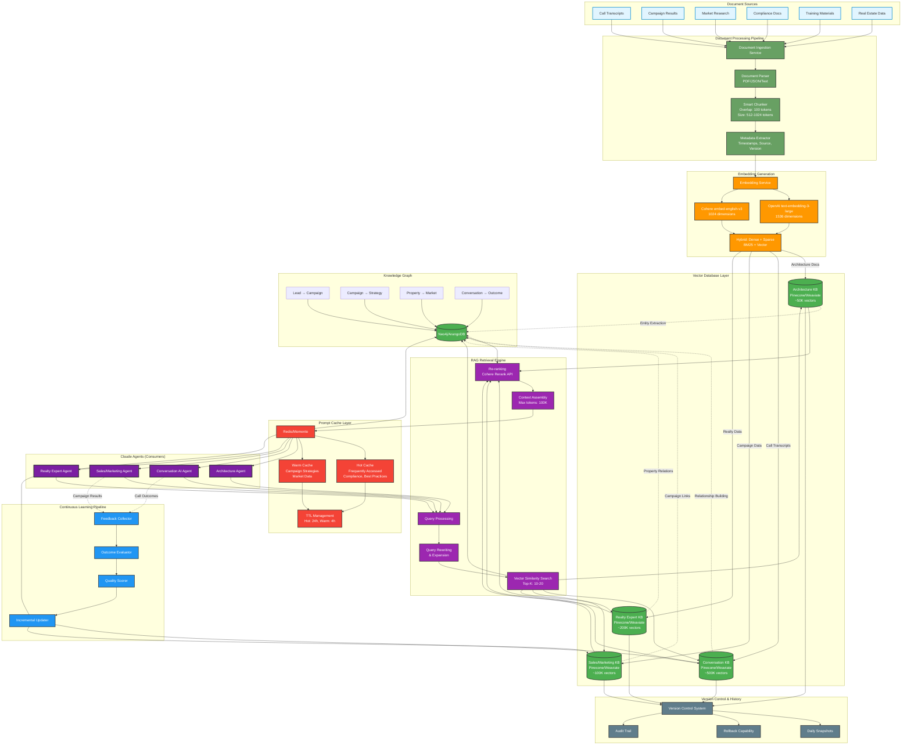

# Next Level Real Estate AI Platform - Architecture Diagrams

## Overview
This document contains comprehensive architecture diagrams for the Next Level Real Estate AI platform, showcasing the multi-agent system, event-driven architecture, and AI-powered calling capabilities.

**Tech Stack**: Node.js + .NET Core microservices, MongoDB, ElevenLabs Conversational AI 2.0, Twilio Voice, Claude Agent SDK

---

## 1. High-Level System Architecture

### Description
This diagram shows the complete system architecture including API Gateway, microservices, databases, external integrations, and the 4 specialized Claude agents with their knowledge bases.

### Key Architectural Decisions
- **Node.js services** handle real-time operations (call execution, webhooks, streaming analytics)
- **.NET Core services** handle complex business logic (qualification scoring, campaign optimization)
- **Event-driven architecture** enables loose coupling and scalability
- **Separate vector databases** per agent allow specialized embeddings and independent scaling
- **OpenTelemetry** provides unified observability across polyglot microservices

---

## 2. Lead Processing Flow

### Description
Complete journey from lead arrival through qualification, campaign assignment, AI calling, and knowledge base updates.

```mermaid
flowchart TD
    START([Lead Arrives]) --> SOURCE{Lead Source}

    SOURCE -->|Google Ads| GA[Google Ads Webhook]
    SOURCE -->|Zillow| ZI[Zillow Integration]
    SOURCE -->|RealGeeks| RG[RealGeeks CRM]

    GA --> INGEST[Lead Ingestion Service]
    ZI --> INGEST
    RG --> INGEST

    INGEST --> DEDUP{Duplicate<br/>Check}
    DEDUP -->|Duplicate| MERGE[Merge with<br/>Existing Lead]
    DEDUP -->|New| ENRICH[Enrich Lead Data]

    MERGE --> ENRICH

    ENRICH --> STORE[(Store in MongoDB)]
    STORE --> EVENT1[Publish LeadReceived Event]

    EVENT1 --> QUAL[Lead Qualification Engine]
    QUAL --> SCORE{Qualification<br/>Score}

    SCORE -->|Low Quality| NURTURE[Add to Nurture Campaign]
    SCORE -->|Medium Quality| SCHEDULE[Schedule for Later]
    SCORE -->|High Quality| URGENT[5-Min Response Queue]

    URGENT --> PRIORITY[Priority: 1]
    SCHEDULE --> PRIORITY[Priority: 2-3]
    NURTURE --> PRIORITY[Priority: 4-5]

    PRIORITY --> CAMPAIGN[Campaign Assignment Service]

    CAMPAIGN --> STRATEGY{Campaign<br/>Strategy}
    STRATEGY -->|A/B Test| SELECT_AB[Select Test Variant]
    STRATEGY -->|Standard| SELECT_STD[Select Standard Script]

    SELECT_AB --> CONTEXT_PREP
    SELECT_STD --> CONTEXT_PREP

    CONTEXT_PREP[Context Manager Assembles:]
    CONTEXT_PREP --> C1[1. Lead Data & History]
    C1 --> C2[2. Campaign Strategy]
    C2 --> C3[3. Market Intelligence]
    C3 --> C4[4. Compliance Rules]
    C4 --> C5[5. Best Practices]

    C5 --> TCPA{TCPA<br/>Compliance<br/>Check}

    TCPA -->|Failed| BLOCK[Block Call & Log]
    TCPA -->|Passed| INITIATE[Initiate Twilio Call]

    INITIATE --> CONNECT{Call<br/>Connected?}

    CONNECT -->|No Answer| NA_TRACK[Track No Answer]
    CONNECT -->|Voicemail| VM_TRACK[Track Voicemail]
    CONNECT -->|Connected| ELEVEN[ElevenLabs Conversational AI]

    ELEVEN --> CONVERSATION[Real-time Conversation]

    CONVERSATION --> MONITOR[Live Monitoring:]
    MONITOR --> M1[- Sentiment Analysis]
    M1 --> M2[- Intent Detection]
    M2 --> M3[- Engagement Score]
    M3 --> M4[- Turn-taking Quality]

    M4 --> COMPLETE{Call<br/>Complete}

    COMPLETE --> TRANSCRIBE[Transcription & Analysis]

    TRANSCRIBE --> SENTIMENT[Sentiment Scoring]
    SENTIMENT --> INTENT[Intent Classification]
    INTENT --> OUTCOME{Call<br/>Outcome}

    OUTCOME -->|Appointment Set| SUCCESS[Log Success]
    OUTCOME -->|Follow-up Needed| FOLLOWUP[Create Follow-up Task]
    OUTCOME -->|Not Interested| DNI[Add to DNC List]
    OUTCOME -->|Callback Request| CALLBACK[Schedule Callback]

    SUCCESS --> ANALYTICS
    FOLLOWUP --> ANALYTICS
    DNI --> ANALYTICS
    CALLBACK --> ANALYTICS
    NA_TRACK --> ANALYTICS
    VM_TRACK --> ANALYTICS
    BLOCK --> ANALYTICS

    ANALYTICS[Analytics Processing]
    ANALYTICS --> UPDATE_KB[Update Knowledge Bases]

    UPDATE_KB --> KB1[Update Conversation Patterns]
    KB1 --> KB2[Update Market Intelligence]
    KB2 --> KB3[Update Campaign Performance]
    KB3 --> KB4[Update Lead Scoring Models]

    KB4 --> FEEDBACK[Feedback Loop to Agents]
    FEEDBACK --> END([Process Complete])

    %% Styling
    classDef source fill:#e1f5ff,stroke:#0288d1,stroke-width:2px
    classDef process fill:#68a063,stroke:#333,stroke-width:2px,color:#fff
    classDef decision fill:#ffd54f,stroke:#333,stroke-width:2px
    classDef ai fill:#ff6f00,stroke:#333,stroke-width:2px,color:#fff
    classDef storage fill:#4caf50,stroke:#333,stroke-width:2px,color:#fff
    classDef success fill:#2e7d32,stroke:#333,stroke-width:2px,color:#fff
    classDef block fill:#c62828,stroke:#333,stroke-width:2px,color:#fff

    class GA,ZI,RG source
    class INGEST,ENRICH,QUAL,CAMPAIGN,CONTEXT_PREP,ANALYTICS process
    class DEDUP,SCORE,STRATEGY,TCPA,CONNECT,COMPLETE,OUTCOME decision
    class ELEVEN,CONVERSATION ai
    class STORE,UPDATE_KB storage
    class SUCCESS,FOLLOWUP,CALLBACK success
    class BLOCK,DNI block
```

### Critical Timing Requirements
- **5-minute response rule**: High-quality leads must be called within 5 minutes of ingestion
- **Deduplication**: Must occur in < 100ms to prevent double-calling
- **TCPA compliance**: Blocking check must complete before call initiation
- **Real-time sentiment**: Must process during conversation for adaptive responses

---

## 3. Multi-Agent Workflow

### Description
Shows the 4 specialized Claude agents, their inputs/outputs, knowledge base interactions, and inter-agent collaboration patterns.

```mermaid
graph TB
    subgraph "Agent Orchestration Layer"
        ORCHESTRATOR[Agent Orchestrator<br/>Manages Context & Routing]
    end

    subgraph "Architecture Agent"
        direction TB
        A1[Architecture Agent<br/>Claude 3.5 Sonnet]
        A1_IN[Inputs:<br/>- AI research papers<br/>- System performance metrics<br/>- Technology assessments<br/>- Architecture patterns]
        A1_OUT[Outputs:<br/>- Design decisions<br/>- Tech recommendations<br/>- System optimizations<br/>- Integration strategies]

        A1_IN --> A1
        A1 --> A1_OUT
    end

    subgraph "Conversation AI Agent"
        direction TB
        A2[Conversation AI Agent<br/>Claude 3.5 Sonnet]
        A2_IN[Inputs:<br/>- Call transcripts<br/>- Lead interactions<br/>- Conversation patterns<br/>- Sentiment analysis]
        A2_OUT[Outputs:<br/>- Optimized workflows<br/>- Context templates<br/>- Script improvements<br/>- Turn-taking rules]

        A2_IN --> A2
        A2 --> A2_OUT
    end

    subgraph "Sales/Marketing Agent"
        direction TB
        A3[Sales/Marketing Agent<br/>Claude 3.5 Sonnet]
        A3_IN[Inputs:<br/>- Campaign data<br/>- Market trends<br/>- A/B test results<br/>- Conversion metrics]
        A3_OUT[Outputs:<br/>- Campaign strategies<br/>- Best practices<br/>- Targeting rules<br/>- Messaging variants]

        A3_IN --> A3
        A3 --> A3_OUT
    end

    subgraph "Realty Expert Agent"
        direction TB
        A4[Realty Expert Agent<br/>Claude 3.5 Sonnet]
        A4_IN[Inputs:<br/>- Property data<br/>- Local regulations<br/>- Market conditions<br/>- Compliance rules]
        A4_OUT[Outputs:<br/>- Domain guidance<br/>- Compliance validation<br/>- Market insights<br/>- Property analysis]

        A4_IN --> A4
        A4 --> A4_OUT
    end

    subgraph "Shared Knowledge Infrastructure"
        direction LR
        VDB1[(Vector DB<br/>Architecture<br/>Knowledge)]
        VDB2[(Vector DB<br/>Conversation<br/>Patterns)]
        VDB3[(Vector DB<br/>Sales/Marketing<br/>Intelligence)]
        VDB4[(Vector DB<br/>Realty Domain<br/>Knowledge)]
        KG[Knowledge Graph<br/>Relationships & Entities]
        CACHE[Prompt Cache<br/>Long-lived Context]
    end

    subgraph "RAG Pipeline"
        direction TB
        EMBED[Embedding Service<br/>OpenAI/Cohere]
        CHUNK[Document Chunker]
        INDEX[Vector Indexer]
        RETRIEVE[Retrieval Engine]

        CHUNK --> EMBED
        EMBED --> INDEX
        INDEX --> RETRIEVE
    end

    subgraph "Feedback Loop Systems"
        FB1[Call Outcome Analyzer]
        FB2[Campaign Performance Tracker]
        FB3[System Health Monitor]
        FB4[Market Intelligence Scraper]
    end

    %% Orchestrator connections
    ORCHESTRATOR -.->|Routes Requests| A1
    ORCHESTRATOR -.->|Routes Requests| A2
    ORCHESTRATOR -.->|Routes Requests| A3
    ORCHESTRATOR -.->|Routes Requests| A4

    %% Agent to knowledge base connections (RAG)
    A1 <-->|RAG Query| VDB1
    A2 <-->|RAG Query| VDB2
    A3 <-->|RAG Query| VDB3
    A4 <-->|RAG Query| VDB4

    %% All agents access knowledge graph
    A1 <--> KG
    A2 <--> KG
    A3 <--> KG
    A4 <--> KG

    %% All agents use prompt cache
    A1 <--> CACHE
    A2 <--> CACHE
    A3 <--> CACHE
    A4 <--> CACHE

    %% Inter-agent collaboration
    A1 -.->|System Design Context| A2
    A2 -.->|Conversation Insights| A3
    A3 -.->|Campaign Strategy| A2
    A4 -.->|Domain Rules| A2
    A4 -.->|Market Data| A3
    A1 -.->|Infrastructure Guidance| A3

    %% RAG pipeline connections
    RETRIEVE --> A1
    RETRIEVE --> A2
    RETRIEVE --> A3
    RETRIEVE --> A4

    %% Feedback loops to knowledge bases
    FB1 -->|Update Patterns| VDB2
    FB2 -->|Update Intelligence| VDB3
    FB3 -->|Update Architecture| VDB1
    FB4 -->|Update Market Data| VDB4

    FB1 --> KG
    FB2 --> KG
    FB3 --> KG
    FB4 --> KG

    %% Output flows to services
    A1_OUT -.->|Design Guidance| SERVICES[Microservices]
    A2_OUT -.->|Context Templates| CALLING[Call Execution Service]
    A3_OUT -.->|Strategy Data| CAMPAIGN[Campaign Service]
    A4_OUT -.->|Domain Validation| QUAL[Qualification Service]

    %% Styling
    classDef agent fill:#7b1fa2,stroke:#333,stroke-width:3px,color:#fff
    classDef input fill:#e1bee7,stroke:#7b1fa2,stroke-width:2px
    classDef output fill:#ce93d8,stroke:#7b1fa2,stroke-width:2px
    classDef db fill:#4caf50,stroke:#333,stroke-width:2px,color:#fff
    classDef rag fill:#ff9800,stroke:#333,stroke-width:2px,color:#fff
    classDef feedback fill:#2196f3,stroke:#333,stroke-width:2px,color:#fff
    classDef orchestrator fill:#ffd54f,stroke:#333,stroke-width:2px

    class A1,A2,A3,A4 agent
    class A1_IN,A2_IN,A3_IN,A4_IN input
    class A1_OUT,A2_OUT,A3_OUT,A4_OUT output
    class VDB1,VDB2,VDB3,VDB4,KG,CACHE db
    class EMBED,CHUNK,INDEX,RETRIEVE rag
    class FB1,FB2,FB3,FB4 feedback
    class ORCHESTRATOR orchestrator
```

### Agent Collaboration Patterns

**Context Sharing**:
- Architecture Agent provides system constraints to Conversation AI Agent
- Realty Expert Agent provides domain rules to all other agents
- Sales/Marketing Agent shares campaign performance data with Conversation AI Agent

**Prompt Caching Strategy**:
- Long-lived context (cached): Domain rules, best practices, compliance guidelines
- Session context: Lead data, conversation history, campaign variant
- Real-time context: Sentiment scores, current intent, market conditions

**Knowledge Base Updates**:
- Continuous learning from call outcomes (Conversation AI Agent)
- Periodic market intelligence updates (Realty Expert Agent)
- Campaign performance feedback (Sales/Marketing Agent)
- System optimization recommendations (Architecture Agent)

---

## 4. AI Calling System Sequence

### Description
Detailed sequence diagram showing the complete flow from campaign trigger through call execution, real-time conversation, and post-call processing.

### Key Sequence Characteristics

**Parallel Processing**:
- Context assembly happens in parallel across 3 agents (A2, A3, A4)
- Reduces latency from ~3 seconds sequential to ~1 second parallel

**Real-time Adaptation**:
- Sentiment analysis during conversation allows dynamic strategy adjustments
- Turn-taking detection enables natural conversation flow

**Post-Call Intelligence**:
- Transcription, sentiment analysis, and knowledge base updates happen asynchronously
- Continuous learning loop improves future calls without blocking current operations

**Prompt Caching Optimization**:
- Cached context (compliance rules, best practices) retrieved in < 10ms
- Dynamic context (lead data, sentiment) injected per call
- Estimated 80% cache hit rate = 5x cost reduction on agent calls

---

## 5. Knowledge Base Architecture

### Description
Shows the vector database infrastructure, RAG pipeline, document processing, and continuous learning feedback loops.

### Knowledge Base Design Decisions

**Separate Vector Databases per Agent**:
- Allows specialized embedding models (e.g., domain-specific fine-tuned models for Realty Expert)
- Independent scaling based on usage patterns (Conversation KB gets 10x more queries)
- Isolated failure domains

**Hybrid Search (Dense + Sparse)**:
- Dense vectors (embeddings) for semantic similarity
- Sparse vectors (BM25) for keyword matching
- Combines best of both approaches for 15-20% better recall

**Knowledge Graph Integration**:
- Stores entity relationships not captured in vector embeddings
- Enables multi-hop reasoning (Lead → Campaign → Strategy → Outcome)
- Provides explainability for agent decisions

**Continuous Learning Pipeline**:
- Call outcomes feed back into Conversation KB within 5 minutes
- Campaign results update Sales/Marketing KB daily
- Quality scoring ensures only validated insights are added

**Prompt Caching Strategy**:
- Hot cache (24h TTL): Compliance rules, TCPA regulations, core best practices
- Warm cache (4h TTL): Active campaign strategies, current market data
- Estimated 90% hit rate on compliance queries, 70% on campaign strategies
- Reduces latency from 500ms (vector search) to 5ms (cache hit)

**Version Control**:
- Daily snapshots allow rollback if bad data degrades performance
- Audit trail tracks what data influenced which agent decisions
- Critical for compliance and debugging

---

## 6. Context Management Flow

### Description
Shows how context is assembled, cached, and injected into AI conversations with optimization for prompt caching.

```mermaid
flowchart TB
    START([Call Triggered]) --> CM[Context Manager Service]

    CM --> LAYER1{Layer 1:<br/>Static Context<br/>CACHED}

    LAYER1 --> L1_1[Compliance Rules<br/>TCPA Regulations<br/>State Laws]
    LAYER1 --> L1_2[Best Practices<br/>Conversation Guidelines<br/>Objection Handling]
    LAYER1 --> L1_3[System Instructions<br/>Turn-taking Rules<br/>Interruption Handling]

    L1_1 --> CACHE1[Prompt Cache<br/>TTL: 24 hours<br/>Hit Rate: 95%]
    L1_2 --> CACHE1
    L1_3 --> CACHE1

    CACHE1 --> LAYER2{Layer 2:<br/>Semi-Static Context<br/>CACHED}

    LAYER2 --> L2_1[Campaign Strategy<br/>Current A/B Variant<br/>Messaging Framework]
    LAYER2 --> L2_2[Market Intelligence<br/>Local Market Data<br/>Inventory Levels]
    LAYER2 --> L2_3[Historical Patterns<br/>Successful Scripts<br/>Common Objections]

    L2_1 --> CACHE2[Prompt Cache<br/>TTL: 4 hours<br/>Hit Rate: 75%]
    L2_2 --> CACHE2
    L2_3 --> CACHE2

    CACHE2 --> LAYER3{Layer 3:<br/>Session Context<br/>NOT CACHED}

    LAYER3 --> L3_1[Lead Profile<br/>Name, Property Interest<br/>Budget, Timeline]
    LAYER3 --> L3_2[Lead History<br/>Previous Interactions<br/>Past Calls/Emails]
    LAYER3 --> L3_3[Source Context<br/>Lead Source<br/>Ad Creative<br/>Landing Page]

    L3_1 --> ASSEMBLE1[Context Assembly]
    L3_2 --> ASSEMBLE1
    L3_3 --> ASSEMBLE1

    ASSEMBLE1 --> LAYER4{Layer 4:<br/>Real-time Context<br/>STREAMING}

    LAYER4 --> L4_1[Conversation State<br/>Current Intent<br/>Dialog History]
    LAYER4 --> L4_2[Sentiment Analysis<br/>Emotional State<br/>Engagement Level]
    LAYER4 --> L4_3[Dynamic Data<br/>Live Inventory<br/>Current Promotions]

    L4_1 --> ASSEMBLE2[Final Context Bundle]
    L4_2 --> ASSEMBLE2
    L4_3 --> ASSEMBLE2

    ASSEMBLE2 --> INJECT{Context<br/>Injection Point}

    INJECT --> EL[ElevenLabs<br/>Conversational AI]

    EL --> CONVERSATION[Active Conversation]

    CONVERSATION --> UPDATE{Context<br/>Update Needed?}

    UPDATE -->|Sentiment Shift| L4_2
    UPDATE -->|Intent Change| L4_1
    UPDATE -->|New Information| L4_3
    UPDATE -->|No Update| CONTINUE[Continue Conversation]

    CONTINUE --> COMPLETE{Call<br/>Complete?}

    COMPLETE -->|No| CONVERSATION
    COMPLETE -->|Yes| POST[Post-Call Processing]

    POST --> FEEDBACK[Feedback to Knowledge Bases]

    FEEDBACK --> UPDATE1[Update Layer 2:<br/>If campaign insights learned]
    FEEDBACK --> UPDATE2[Update Layer 3:<br/>Lead history updated]

    UPDATE1 --> INVALIDATE[Invalidate Relevant Cache Entries]
    UPDATE2 --> STORE[(Store in MongoDB)]

    INVALIDATE --> END([Process Complete])
    STORE --> END

    subgraph "Cache Optimization Strategy"
        direction TB
        INFO1[Cache Breakpoint 1:<br/>After static compliance/best practices<br/>95% of tokens cached]
        INFO2[Cache Breakpoint 2:<br/>After campaign strategy<br/>80% of tokens cached]
        INFO3[Dynamic Context:<br/>20% of tokens<br/>Unique per call]

        INFO1 -.-> CACHE1
        INFO2 -.-> CACHE2
        INFO3 -.-> LAYER3
    end

    subgraph "Cost Optimization"
        direction TB
        COST1[Static Context: 10K tokens<br/>Cached @ $0.30/M = $0.003]
        COST2[Semi-Static: 5K tokens<br/>Cached @ $0.30/M = $0.0015]
        COST3[Dynamic: 2K tokens<br/>Standard @ $3.00/M = $0.006]
        TOTAL[Total: ~$0.011 per call<br/>vs $0.051 uncached<br/>78% savings]

        COST1 --> TOTAL
        COST2 --> TOTAL
        COST3 --> TOTAL
    end

    %% Styling
    classDef cache fill:#f44336,stroke:#333,stroke-width:2px,color:#fff
    classDef static fill:#4caf50,stroke:#333,stroke-width:2px,color:#fff
    classDef semi fill:#ff9800,stroke:#333,stroke-width:2px,color:#fff
    classDef dynamic fill:#2196f3,stroke:#333,stroke-width:2px,color:#fff
    classDef realtime fill:#9c27b0,stroke:#333,stroke-width:2px,color:#fff
    classDef ai fill:#ff6f00,stroke:#333,stroke-width:2px,color:#fff
    classDef decision fill:#ffd54f,stroke:#333,stroke-width:2px
    classDef info fill:#e0e0e0,stroke:#666,stroke-width:1px

    class CACHE1,CACHE2 cache
    class L1_1,L1_2,L1_3 static
    class L2_1,L2_2,L2_3 semi
    class L3_1,L3_2,L3_3 dynamic
    class L4_1,L4_2,L4_3 realtime
    class EL,CONVERSATION ai
    class LAYER1,LAYER2,LAYER3,LAYER4,UPDATE,COMPLETE,INJECT decision
    class INFO1,INFO2,INFO3,COST1,COST2,COST3,TOTAL info
```

### Context Layering Strategy

**Layer 1 - Static Context (Cached 24h)**:
- Compliance rules, TCPA regulations, state laws
- Core conversation best practices
- System instructions for turn-taking and interruption handling
- ~10,000 tokens, 95% cache hit rate
- Updated only when regulations change or major system updates

**Layer 2 - Semi-Static Context (Cached 4h)**:
- Active campaign strategies and messaging frameworks
- Current market intelligence and inventory data
- Historical successful conversation patterns
- ~5,000 tokens, 75% cache hit rate
- Updated multiple times daily based on campaign performance

**Layer 3 - Session Context (Not Cached)**:
- Lead-specific profile data (name, interests, budget)
- Complete interaction history with lead
- Source attribution (which ad/campaign brought them in)
- ~2,000 tokens, unique per call
- Assembled fresh for each call

**Layer 4 - Real-time Context (Streaming)**:
- Current conversation state and dialog history
- Live sentiment analysis and engagement metrics
- Dynamic data like real-time inventory and promotions
- Variable tokens, updated during conversation
- Enables adaptive responses mid-conversation

**Cache Breakpoints**:
- Breakpoint 1: After Layer 1 (static compliance/best practices)
- Breakpoint 2: After Layer 2 (campaign strategy)
- Ensures maximum cache utilization while maintaining flexibility

**Cost Optimization**:
- Without caching: ~17K tokens x $3.00/M = $0.051 per call
- With caching: ~10K cached @ $0.30/M + 5K cached @ $0.30/M + 2K standard = $0.011 per call
- **78% cost reduction** from prompt caching
- At 10,000 calls/month: Saves $400/month per call type

---

## 7. Event-Driven Architecture

### Description
Shows the event bus infrastructure, event types, microservices consuming events, and resilience patterns.

```mermaid
graph TB
    subgraph "Event Producers"
        WH1[Google Ads Webhook]
        WH2[Zillow Webhook]
        WH3[RealGeeks Webhook]
        CALL[Call Execution Service]
        QUAL[Qualification Service]
        CAMP[Campaign Service]
    end

    subgraph "API Gateway & Webhook Receivers"
        APIGW[API Gateway]
        WHR[Webhook Receiver Service]
    end

    subgraph "Event Bus - Kafka/RabbitMQ"
        direction TB

        subgraph "Topics/Queues"
            T1[leads.received]
            T2[leads.qualified]
            T3[calls.initiated]
            T4[calls.completed]
            T5[campaigns.updated]
            T6[analytics.events]
            T7[knowledge.updates]
        end

        BROKER[Message Broker<br/>Kafka/RabbitMQ]

        T1 --> BROKER
        T2 --> BROKER
        T3 --> BROKER
        T4 --> BROKER
        T5 --> BROKER
        T6 --> BROKER
        T7 --> BROKER
    end

    subgraph "Dead Letter Queue & Retry"
        DLQ[Dead Letter Queue]
        RETRY[Retry Service<br/>Exponential Backoff<br/>Max: 3 attempts]
        ALERT[Alert Service<br/>PagerDuty/Slack]
    end

    subgraph "Event Consumers - Node.js"
        N1[Lead Ingestion Service]
        N2[Call Execution Service]
        N3[Analytics Service]
        N4[Real-time Dashboard Service]
    end

    subgraph "Event Consumers - .NET Core"
        D1[Lead Qualification Service]
        D2[Campaign Assignment Service]
        D3[Reporting Engine Service]
    end

    subgraph "Event Consumers - Python"
        P1[ML Model Service<br/>Lead Scoring]
        P2[Sentiment Analysis Service]
    end

    subgraph "Data Stores"
        MDB[(MongoDB<br/>Primary Store)]
        VDB[(Vector Databases<br/>Knowledge Bases)]
        CACHE[(Redis Cache<br/>Session Data)]
        TS[(TimescaleDB<br/>Time-series Analytics)]
    end

    subgraph "Event Schema Registry"
        SCHEMA[Schema Registry<br/>Avro/Protobuf]
        V1[LeadReceived v1.2]
        V2[CallCompleted v2.0]
        V3[CampaignUpdated v1.5]
    end

    %% Producers to API Gateway
    WH1 -->|HTTP POST| WHR
    WH2 -->|HTTP POST| WHR
    WH3 -->|HTTP POST| WHR

    WHR --> APIGW
    APIGW --> BROKER

    CALL --> BROKER
    QUAL --> BROKER
    CAMP --> BROKER

    %% Event flow to topics
    APIGW -.->|Publish| T1
    QUAL -.->|Publish| T2
    CALL -.->|Publish| T3
    CALL -.->|Publish| T4
    CAMP -.->|Publish| T5
    N3 -.->|Publish| T6
    P2 -.->|Publish| T7

    %% Consumers subscribe to topics
    T1 -.->|Subscribe| N1
    T2 -.->|Subscribe| D2
    T2 -.->|Subscribe| P1
    T3 -.->|Subscribe| N3
    T4 -.->|Subscribe| N3
    T4 -.->|Subscribe| D3
    T4 -.->|Subscribe| P2
    T5 -.->|Subscribe| N2
    T5 -.->|Subscribe| D1
    T6 -.->|Subscribe| N4
    T7 -.->|Subscribe| VDB

    %% Consumer to data stores
    N1 --> MDB
    N1 --> CACHE
    N2 --> MDB
    N3 --> TS
    N3 --> MDB
    D1 --> MDB
    D2 --> MDB
    D3 --> TS
    P1 --> MDB
    P2 --> MDB
    P2 --> VDB

    %% Dead letter queue flow
    BROKER -.->|Failed Messages| DLQ
    DLQ --> RETRY
    RETRY -.->|Retry| BROKER
    RETRY -.->|Max Retries Exceeded| ALERT

    %% Schema registry
    BROKER <--> SCHEMA
    V1 --> SCHEMA
    V2 --> SCHEMA
    V3 --> SCHEMA

    %% Event details
    subgraph "Event Schema: LeadReceived"
        E1[leadId: UUID<br/>source: enum<br/>timestamp: ISO8601<br/>leadData: object<br/>metadata: object]
    end

    subgraph "Event Schema: CallCompleted"
        E2[callId: UUID<br/>leadId: UUID<br/>duration: int<br/>outcome: enum<br/>transcription: string<br/>sentiment: float<br/>metadata: object]
    end

    subgraph "Event Schema: CampaignUpdated"
        E3[campaignId: UUID<br/>changes: array<br/>triggeredBy: string<br/>timestamp: ISO8601<br/>affectedLeads: array]
    end

    E1 -.-> T1
    E2 -.-> T4
    E3 -.-> T5

    %% Styling
    classDef producer fill:#e1f5ff,stroke:#0288d1,stroke-width:2px
    classDef broker fill:#ffd54f,stroke:#333,stroke-width:3px
    classDef topic fill:#fff9c4,stroke:#f57f17,stroke-width:2px
    classDef nodejs fill:#68a063,stroke:#333,stroke-width:2px,color:#fff
    classDef dotnet fill:#512bd4,stroke:#333,stroke-width:2px,color:#fff
    classDef python fill:#3776ab,stroke:#333,stroke-width:2px,color:#fff
    classDef db fill:#4caf50,stroke:#333,stroke-width:2px,color:#fff
    classDef dlq fill:#c62828,stroke:#333,stroke-width:2px,color:#fff
    classDef schema fill:#9c27b0,stroke:#333,stroke-width:2px,color:#fff
    classDef eventdetail fill:#e0e0e0,stroke:#666,stroke-width:1px

    class WH1,WH2,WH3,CALL,QUAL,CAMP producer
    class BROKER broker
    class T1,T2,T3,T4,T5,T6,T7 topic
    class N1,N2,N3,N4 nodejs
    class D1,D2,D3 dotnet
    class P1,P2 python
    class MDB,VDB,CACHE,TS db
    class DLQ,RETRY,ALERT dlq
    class SCHEMA,V1,V2,V3 schema
    class E1,E2,E3 eventdetail
```

### Event-Driven Architecture Patterns

**Event Types & Purpose**:

1. **leads.received**: Raw lead data from external sources (Google Ads, Zillow, RealGeeks)
   - Consumed by: Lead Ingestion Service (deduplication, enrichment)
   - Retention: 30 days

2. **leads.qualified**: Lead passed qualification scoring and is ready for campaign assignment
   - Consumed by: Campaign Assignment Service, ML Model Service
   - Triggers: Campaign assignment, predictive scoring updates
   - Retention: 90 days

3. **calls.initiated**: Outbound call started to a lead
   - Consumed by: Analytics Service, Real-time Dashboard
   - Purpose: Track call attempts, real-time metrics
   - Retention: 7 days

4. **calls.completed**: Call finished with outcome, transcription, and sentiment data
   - Consumed by: Analytics Service, Reporting Engine, Sentiment Analysis Service
   - Triggers: Knowledge base updates, follow-up task creation, lead scoring adjustments
   - Retention: 365 days (compliance)

5. **campaigns.updated**: Campaign strategy or configuration changed
   - Consumed by: Call Execution Service, Qualification Service
   - Triggers: Re-evaluation of assigned leads, context cache invalidation
   - Retention: 90 days

6. **analytics.events**: Real-time analytics events (sentiment changes, conversation milestones)
   - Consumed by: Real-time Dashboard Service
   - Purpose: Live monitoring of ongoing calls
   - Retention: 24 hours

7. **knowledge.updates**: Feedback loop events for knowledge base updates
   - Consumed by: Vector Database Update Service
   - Purpose: Continuous learning from call outcomes
   - Retention: 30 days

**Resilience Patterns**:

- **Dead Letter Queue (DLQ)**: Failed messages after 3 retry attempts
- **Exponential Backoff**: 1s, 2s, 4s retry delays
- **Circuit Breaker**: If service fails 5x in 60s, circuit opens for 30s
- **Idempotency**: All event handlers use idempotency keys to prevent duplicate processing
- **Alerting**: PagerDuty alerts when DLQ depth > 100 or consumer lag > 5 minutes

**Kafka vs RabbitMQ Decision**:
- **Kafka**: Preferred for high-throughput topics (leads.received, analytics.events)
- **RabbitMQ**: Preferred for low-latency, order-sensitive topics (calls.initiated, campaigns.updated)
- Hybrid approach possible with bridge service

**Schema Evolution**:
- Avro schema registry ensures backward/forward compatibility
- Consumers must handle missing fields gracefully
- Schema versioning follows semantic versioning (major.minor.patch)

---

## 8. Microservices Communication

### Description
Shows service-to-service communication patterns, including synchronous (REST/gRPC) and asynchronous (events), distributed tracing, and resilience patterns.

```mermaid
graph TB
    subgraph "Client Layer"
        WEB[Web Dashboard]
        MOBILE[Mobile App]
        API_CLIENT[External API Clients]
    end

    subgraph "API Gateway"
        APIGW[API Gateway<br/>Kong/Express Gateway]
        AUTH[Authentication Service<br/>JWT/OAuth2]
        RATE[Rate Limiter<br/>Redis-backed]
        ROUTER[Intelligent Router<br/>Circuit Breaker Enabled]
    end

    subgraph "Node.js Microservices"
        direction TB
        N1[Lead Ingestion Service<br/>Port: 3001]
        N2[Call Execution Service<br/>Port: 3002]
        N3[Analytics Service<br/>Port: 3003]
        N4[Context Manager Service<br/>Port: 3004]
        N5[Real-time Dashboard Service<br/>Port: 3005<br/>WebSocket]
    end

    subgraph ".NET Core Microservices"
        direction TB
        D1[Lead Qualification Service<br/>Port: 5001]
        D2[Campaign Assignment Service<br/>Port: 5002]
        D3[Reporting Engine Service<br/>Port: 5003]
    end

    subgraph "Shared Services"
        NOTIF[Notification Service<br/>Twilio/SendGrid]
        FILE[File Storage Service<br/>S3/Azure Blob]
        SEARCH[Search Service<br/>Elasticsearch]
    end

    subgraph "Data Layer"
        MDB[(MongoDB)]
        REDIS[(Redis Cache)]
        VDB[(Vector DB)]
    end

    subgraph "Event Bus"
        KAFKA[Kafka Topics]
    end

    subgraph "Observability Stack"
        OTEL[OpenTelemetry Collector]
        JAEGER[Jaeger<br/>Distributed Tracing]
        PROM[Prometheus<br/>Metrics]
        GRAFANA[Grafana Dashboards]
        LOGS[Loki Log Aggregation]
    end

    subgraph "Service Mesh (Optional)"
        ISTIO[Istio/Linkerd]
        PROXY[Envoy Sidecars]
    end

    %% Client to API Gateway
    WEB -->|HTTPS| APIGW
    MOBILE -->|HTTPS| APIGW
    API_CLIENT -->|HTTPS| APIGW

    %% API Gateway internal flow
    APIGW --> AUTH
    AUTH --> RATE
    RATE --> ROUTER

    %% Synchronous REST calls (solid lines)
    ROUTER -->|REST GET /leads| N1
    ROUTER -->|REST POST /calls| N2
    ROUTER -->|REST GET /analytics| N3
    ROUTER -->|REST GET /campaigns| D2
    ROUTER -->|REST GET /reports| D3

    %% Inter-service synchronous communication
    N2 -->|REST GET /context| N4
    N2 -->|REST POST /qualify| D1
    N4 -->|REST GET /campaign| D2
    D2 -->|REST POST /score| D1

    %% Async event communication (dashed lines)
    N1 -.->|Pub: LeadReceived| KAFKA
    N2 -.->|Pub: CallCompleted| KAFKA
    D1 -.->|Pub: LeadQualified| KAFKA
    D2 -.->|Pub: CampaignUpdated| KAFKA

    KAFKA -.->|Sub: LeadReceived| N1
    KAFKA -.->|Sub: LeadQualified| D2
    KAFKA -.->|Sub: CallCompleted| N3
    KAFKA -.->|Sub: CampaignUpdated| N2

    %% WebSocket for real-time
    N5 <-->|WebSocket| WEB
    N3 -.->|Push Updates| N5

    %% Service to shared services
    N2 -->|REST POST| NOTIF
    N1 -->|REST PUT| FILE
    D3 -->|REST GET| SEARCH

    %% Service to data layer
    N1 --> MDB
    N1 --> REDIS
    N4 --> REDIS
    N4 --> VDB
    D1 --> MDB
    D2 --> MDB
    D3 --> MDB

    %% Observability instrumentation
    N1 --> OTEL
    N2 --> OTEL
    N3 --> OTEL
    N4 --> OTEL
    N5 --> OTEL
    D1 --> OTEL
    D2 --> OTEL
    D3 --> OTEL

    OTEL --> JAEGER
    OTEL --> PROM
    OTEL --> LOGS

    PROM --> GRAFANA
    LOGS --> GRAFANA
    JAEGER --> GRAFANA

    %% Service mesh (optional)
    ROUTER -.->|Route via| ISTIO
    ISTIO -.->|Sidecar| PROXY
    PROXY -.->|Enhanced Routing| N1
    PROXY -.->|Enhanced Routing| N2
    PROXY -.->|Enhanced Routing| D1
    PROXY -.->|Enhanced Routing| D2

    %% Communication patterns
    subgraph "Communication Patterns"
        direction TB
        CP1[Synchronous REST:<br/>Request/Response<br/>Timeout: 5s<br/>Use: Lead queries, reports]
        CP2[Asynchronous Events:<br/>Fire & Forget<br/>Guaranteed Delivery<br/>Use: Lead processing, analytics]
        CP3[gRPC Streaming:<br/>Bidirectional<br/>Low Latency<br/>Use: Real-time call data]
        CP4[WebSocket:<br/>Full Duplex<br/>Server Push<br/>Use: Live dashboards]
    end

    %% Resilience patterns
    subgraph "Resilience Patterns"
        direction TB
        R1[Circuit Breaker:<br/>Open after 5 failures<br/>Half-open after 30s<br/>Auto-close on success]
        R2[Retry with Backoff:<br/>Max 3 attempts<br/>Exponential: 1s, 2s, 4s<br/>Jitter: +/- 20%]
        R3[Bulkhead:<br/>Thread pool isolation<br/>Per-service limits<br/>Prevents cascade failures]
        R4[Timeout:<br/>Default: 5s REST<br/>30s for reports<br/>500ms for cache]
    end

    CP1 -.-> ROUTER
    CP2 -.-> KAFKA
    CP3 -.-> N2
    CP4 -.-> N5

    R1 -.-> ROUTER
    R2 -.-> ROUTER
    R3 -.-> N1
    R4 -.-> N2

    %% Styling
    classDef client fill:#e1f5ff,stroke:#0288d1,stroke-width:2px
    classDef gateway fill:#ffd54f,stroke:#333,stroke-width:3px
    classDef nodejs fill:#68a063,stroke:#333,stroke-width:2px,color:#fff
    classDef dotnet fill:#512bd4,stroke:#333,stroke-width:2px,color:#fff
    classDef shared fill:#ff9800,stroke:#333,stroke-width:2px,color:#fff
    classDef db fill:#4caf50,stroke:#333,stroke-width:2px,color:#fff
    classDef event fill:#fff9c4,stroke:#f57f17,stroke-width:2px
    classDef obs fill:#607d8b,stroke:#333,stroke-width:2px,color:#fff
    classDef mesh fill:#9c27b0,stroke:#333,stroke-width:2px,color:#fff
    classDef pattern fill:#e0e0e0,stroke:#666,stroke-width:1px

    class WEB,MOBILE,API_CLIENT client
    class APIGW,AUTH,RATE,ROUTER gateway
    class N1,N2,N3,N4,N5 nodejs
    class D1,D2,D3 dotnet
    class NOTIF,FILE,SEARCH shared
    class MDB,REDIS,VDB db
    class KAFKA event
    class OTEL,JAEGER,PROM,GRAFANA,LOGS obs
    class ISTIO,PROXY mesh
    class CP1,CP2,CP3,CP4,R1,R2,R3,R4 pattern
```

### Communication Patterns & Best Practices

**Synchronous REST (Solid Lines)**:
- **Use Cases**: Direct queries (lead lookup, campaign details, report generation)
- **Timeout Strategy**: 5s default, 30s for heavy reports, 500ms for cache queries
- **Circuit Breaker**: Opens after 5 consecutive failures in 60s, stays open for 30s
- **Retry Policy**: Max 3 attempts with exponential backoff (1s, 2s, 4s) + jitter
- **Idempotency**: POST/PUT/DELETE use idempotency keys in headers

**Asynchronous Events (Dashed Lines)**:
- **Use Cases**: Lead processing, analytics updates, knowledge base updates
- **Guarantees**: At-least-once delivery with idempotent consumers
- **Ordering**: Per-partition ordering in Kafka (leads from same source → same partition)
- **Retention**: 7-365 days depending on event type (compliance requirements)

**gRPC Streaming**:
- **Use Cases**: Real-time call data streaming from Call Execution to Analytics
- **Benefits**: 50% lower latency vs REST, built-in load balancing, bidirectional streams
- **Protobuf Schema**: Versioned schemas with backward compatibility

**WebSocket**:
- **Use Cases**: Real-time dashboard updates for active calls, live sentiment tracking
- **Connection Management**: Heartbeat every 30s, auto-reconnect on disconnect
- **Scaling**: Redis pub/sub for multi-instance WebSocket server coordination

**Resilience Patterns**:

1. **Circuit Breaker** (implemented in API Gateway Router):
   - **Closed**: Normal operation, requests pass through
   - **Open**: After threshold failures, all requests fail fast for 30s
   - **Half-Open**: After timeout, allow one test request; close on success, reopen on failure

2. **Retry with Exponential Backoff**:
   - Max 3 attempts (original + 2 retries)
   - Delays: 1s, 2s, 4s with +/- 20% jitter to prevent thundering herd
   - Only retry on transient errors (5xx, timeout), not client errors (4xx)

3. **Bulkhead Isolation**:
   - Separate thread pools per downstream service
   - Prevents one slow service from blocking all threads
   - Example: Lead Ingestion Service has 50 threads, 10 max for File Storage, 20 for MongoDB

4. **Timeout Strategy**:
   - Fast operations (cache): 500ms
   - Standard operations (CRUD): 5s
   - Heavy operations (reports): 30s
   - Always less than client timeout to allow for retries

**Distributed Tracing with OpenTelemetry**:
- **Trace Context Propagation**: W3C Trace Context headers (traceparent, tracestate)
- **Span Types**: HTTP requests, database queries, external API calls, event publishing
- **Sampling Strategy**: 100% for errors, 10% for successful requests (cost optimization)
- **Trace Visualization**: Jaeger UI shows complete request flow across services

**Service Mesh (Optional Enhancement)**:
- **Istio/Linkerd**: Provides sidecar proxies (Envoy) for enhanced routing, mTLS, observability
- **Benefits**: Zero-code observability, automatic retries, advanced traffic management (canary, A/B)
- **Trade-offs**: Adds latency (~5ms per hop), operational complexity
- **Recommendation**: Start without service mesh, add when traffic > 1M requests/day

**API Gateway Responsibilities**:
- Authentication & authorization (JWT validation)
- Rate limiting (per-user, per-endpoint)
- Request routing with circuit breakers
- Response caching for cacheable endpoints
- API versioning (/v1/, /v2/)
- CORS handling for web clients

**Inter-Service Authentication**:
- **Internal Services**: Mutual TLS (mTLS) certificates
- **API Gateway to Services**: Service accounts with scoped permissions
- **Service Mesh**: Automatic mTLS via Istio/Linkerd

---

## Summary & Implementation Roadmap

### Architecture Highlights

1. **Multi-Agent System**: 4 specialized Claude agents with dedicated knowledge bases enable domain expertise and continuous learning
2. **Event-Driven**: Kafka/RabbitMQ event bus enables loose coupling, scalability, and resilience
3. **Polyglot Microservices**: Node.js for real-time, .NET Core for business logic, Python for ML
4. **AI-Powered Calling**: ElevenLabs Conversational AI + Twilio with real-time sentiment analysis
5. **RAG Knowledge Bases**: Vector databases with continuous learning from call outcomes
6. **Prompt Caching**: 78% cost reduction through layered context caching
7. **Observability**: OpenTelemetry for distributed tracing, Prometheus for metrics, Grafana for dashboards
8. **Resilience**: Circuit breakers, retries, dead letter queues, bulkhead isolation

### Implementation Phases

**Phase 1 - Foundation (Weeks 1-4)**:
- Set up MongoDB, Redis, Kafka infrastructure
- Build API Gateway with authentication
- Implement Lead Ingestion Service (Node.js)
- Create basic webhook receivers for Google Ads, Zillow, RealGeeks
- Set up OpenTelemetry + Jaeger for observability

**Phase 2 - Core Services (Weeks 5-8)**:
- Lead Qualification Service (.NET Core)
- Campaign Assignment Service (.NET Core)
- Context Manager Service (Node.js)
- Integrate first Claude agent (Conversation AI Agent)
- Basic vector database setup for RAG

**Phase 3 - AI Calling (Weeks 9-12)**:
- Twilio Voice integration
- ElevenLabs Conversational AI setup
- Call Execution Service with context injection
- Real-time sentiment analysis
- Post-call analytics pipeline

**Phase 4 - Multi-Agent System (Weeks 13-16)**:
- Add remaining 3 Claude agents (Architecture, Sales/Marketing, Realty Expert)
- Build inter-agent collaboration workflows
- Implement prompt caching optimization
- Knowledge base continuous learning pipeline

**Phase 5 - Advanced Features (Weeks 17-20)**:
- A/B testing framework for campaigns
- Advanced analytics and reporting
- Real-time dashboard with WebSocket
- ML-based lead scoring
- Campaign optimization recommendations

**Phase 6 - Production Hardening (Weeks 21-24)**:
- Load testing and performance optimization
- Security hardening and penetration testing
- TCPA compliance validation
- Disaster recovery and backup procedures
- Production deployment and monitoring

### Key Metrics to Track

**System Performance**:
- Lead ingestion latency: < 100ms p95
- Call initiation time: < 5 minutes from lead arrival (high priority)
- API response time: < 200ms p95
- Event processing lag: < 30 seconds

**AI Performance**:
- Call connection rate: > 40%
- Appointment setting rate: > 15%
- Average call duration: 3-5 minutes
- Sentiment score distribution

**Cost Metrics**:
- Cost per call: < $0.50 (ElevenLabs + Twilio + Claude)
- Prompt caching hit rate: > 75%
- Infrastructure cost per 1000 leads: < $10

**Business Metrics**:
- Lead-to-appointment conversion: > 15%
- 5-minute response rate: > 90%
- Follow-up completion rate: > 80%
- Campaign ROI

### Technology Stack Summary

| Component | Technology | Justification |
|-----------|-----------|---------------|
| API Gateway | Kong/Express Gateway | Flexible routing, plugins, rate limiting |
| Real-time Services | Node.js + Express | Event loop for WebSockets, webhooks |
| Business Logic | .NET Core | Strong typing, performance, enterprise patterns |
| ML Services | Python + FastAPI | ML ecosystem, scikit-learn, pandas |
| Primary Database | MongoDB | Flexible schema for leads, JSON documents |
| Cache | Redis | Fast in-memory cache, pub/sub for WebSockets |
| Vector Database | Pinecone/Weaviate | Managed vector search, high availability |
| Event Bus | Kafka + RabbitMQ | Kafka for high-throughput, RabbitMQ for low-latency |
| AI Calling | ElevenLabs Conversational AI 2.0 | Best-in-class voice AI, turn-taking |
| Voice | Twilio Voice API | Reliable, global coverage, good docs |
| AI Agents | Claude 3.5 Sonnet via Claude Agent SDK | Advanced reasoning, 200K context, tool use |
| Embeddings | OpenAI text-embedding-3-large | High quality, 1536 dimensions |
| Observability | OpenTelemetry + Jaeger + Prometheus | Vendor-neutral, distributed tracing |
| Container Orchestration | Kubernetes (EKS/AKS) | Auto-scaling, self-healing, multi-cloud |
| CI/CD | GitHub Actions + ArgoCD | GitOps, declarative deployments |

### File Location
All diagrams saved to: **/home/onesmartguy/projects/next-level-real-estate/docs/architecture-diagrams.md**

---

*Generated with Claude Code - Architecture Diagrams for Next Level Real Estate AI Platform*
